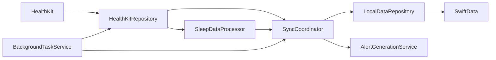
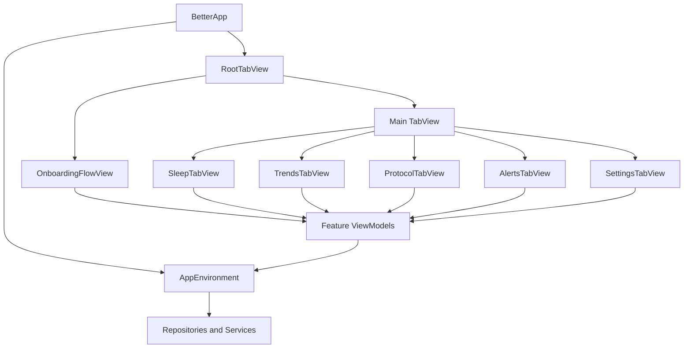

# Better Project Architecture

Last updated: 2026-05-04

This document summarizes the current codebase shape, the local data/backend layers, and how the SwiftUI frontend is wired.

## Current Files

Top-level project files:

- `Better.xcodeproj/`
- `Better/`
- `BetterTests/`
- `BetterUITests/`
- `Core_sleep_dashbaord.md`
- `BASELINE_AND_HISTORY_IMPLEMENTATION.md`
- `agent.md`
- `current_completed_phase.md`

Primary app source layout:

- `Better/App/`
- `Better/Core/`
- `Better/Features/`
- `Better/Info.plist`
- `Better/Better.entitlements`

Important core files:

- `Better/App/BetterApp.swift`
- `Better/App/AppEnvironment.swift`
- `Better/App/RootTabView.swift`
- `Better/Core/Repositories/RepositoryProtocols.swift`
- `Better/Core/Repositories/HealthKitRepository.swift`
- `Better/Core/Repositories/LocalDataRepository.swift`
- `Better/Core/Repositories/MockLocalDataRepository.swift`
- `Better/Core/Repositories/PreviewHealthKitRepository.swift`
- `Better/Core/Processors/SleepDataProcessor.swift`
- `Better/Core/Services/SyncCoordinator.swift`
- `Better/Core/Services/BackgroundTaskService.swift`
- `Better/Core/Services/AlertGenerationService.swift`
- `Better/Core/Persistence/PersistenceModels.swift`
- `Better/Core/Models/`

Important feature files:

- `Better/Features/Sleep/SleepTabView.swift`
- `Better/Features/Trends/TrendsTabView.swift`
- `Better/Features/Protocol/ProtocolTabView.swift`
- `Better/Features/Alerts/AlertsTabView.swift`
- `Better/Features/Settings/SettingsTabView.swift`
- `Better/Features/Onboarding/OnboardingFlowView.swift`

## Backend Structure

The app does not use a remote API backend. The backend logic is local and is built from Apple frameworks plus in-app domain services.

### Layering

1. HealthKit is the source of raw sleep and biometrics.
2. `HealthKitRepository` reads HealthKit data and produces domain samples.
3. `SleepDataProcessor` turns raw samples into normalized sleep sessions, baselines, and biometrics.
4. `LocalDataRepository` stores derived data in SwiftData.
5. `SyncCoordinator` orchestrates authorization, initial sync, foreground refresh, and incremental refresh.
6. `AlertGenerationService` derives alerts from sessions, baselines, profile settings, and adherence.
7. `BackgroundTaskService` triggers incremental refreshes in the background.

### Core Responsibilities

- `RepositoryProtocols.swift` defines the contracts for HealthKit and local storage.
- `HealthKitRepository.swift` handles permission requests, sleep sample fetches, biometrics fetches, source summaries, observer queries, and anchored incremental reads.
- `SleepDataProcessor.swift` contains the pure sleep logic: overlap cleanup, stage grouping, session splitting, date-key assignment, latency/WASO/efficiency calculation, baseline computation, and biometric summarization.
- `PersistenceModels.swift` maps domain structs into SwiftData models and back.
- `LocalDataRepository.swift` persists sessions, baselines, alerts, adherence, profile, and sync anchors.
- `SyncCoordinator.swift` owns the sync lifecycle and turns HealthKit updates into cached app data.
- `AlertGenerationService.swift` turns derived sleep data into in-app alerts and optional local notifications.

### Backend Data Flow

## Frontend Structure

The frontend is a SwiftUI shell with tab-based navigation and feature-specific view models.

### Root Flow

- `BetterApp` creates the app environment and starts observer/background services.
- `RootTabView` decides whether to show onboarding or the main tab shell.
- `OnboardingFlowView` collects initial settings and permissions.
- After onboarding, the main tabs load:
  - Sleep
  - Trends
  - Protocol
  - Alerts
  - Settings

### Frontend Layers

1. SwiftUI views render the UI.
2. View models own screen state and call repositories/services.
3. The app environment injects shared dependencies.
4. Views stay thin and primarily compose existing cards, charts, and sections.

### Frontend Flow Diagram

## What Each Screen Does

- Sleep tab: shows the current night, score ring, baseline comparison, stage timeline, biometrics, and schedule consistency.
- Trends tab: shows 7/14/30 day metrics, charts, and protocol impact summaries.
- Protocol tab: shows active protocol items, adherence, streaks, heatmap, and impact.
- Alerts tab: shows alert history, notification settings, and alert thresholds.
- Settings tab: shows profile settings, connected sources, Health status, research export, and app-level preferences.
- Onboarding: collects the sleep goal, sleep assessment, notification preference, and research mode preference.

## Notes

- HealthKit is read-only in the current implementation.
- The app persists derived data locally through SwiftData.
- The onboarding assessment answers are stored on `UserProfile` so they are available later in Settings and future personalization work.
- Baseline and historical dashboard changes should follow `BASELINE_AND_HISTORY_IMPLEMENTATION.md`: initial HealthKit history backfill, date-aware baseline calculation, today-first dashboard state, and optional older date browsing from cached SwiftData sessions.
